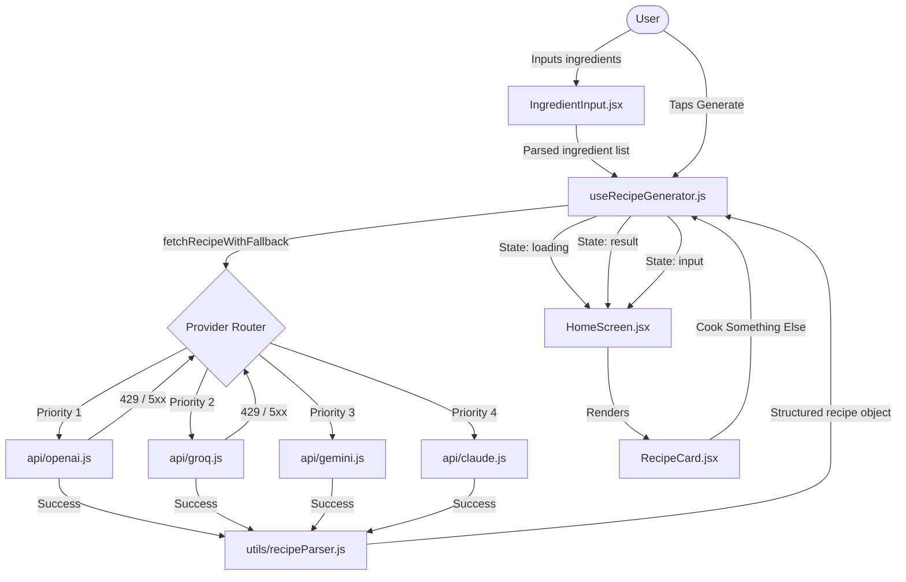

# Smart Ingredient Recipe Generator 🍳

A premium single-screen React Native (Expo) mobile app that generates detailed, professional recipes from ingredients you already have in your kitchen — powered by your choice of **OpenAI, Groq, Google Gemini, or Anthropic Claude**.

Configure one or more API keys and the app automatically picks the best available provider, with silent failover if one hits its rate limit.

Built with performance, premium UX/UI, and accessibility at its core.

---

## 🌟 Key Features

*   **Multi-LLM Support:** Works with OpenAI (GPT-4o mini), Groq (Llama 3.3 70B), Google Gemini (1.5 Flash), and Anthropic Claude (Haiku). Add any combination of keys and the app handles the rest.
*   **Smart Auto-Failover:** When multiple API keys are configured, the app tries providers in priority order. If one hits a rate limit or server error, it silently retries with the next available provider — no interruption to the user.
*   **Smart Ingredient Parsing:** Enter ingredients using commas (or spaces). The app automatically parses, de-duplicates, and displays them as animated pill tags.
*   **Pantry Staples Quick Add:** Frequently used kitchen staples (eggs, onion, pasta, cheese, etc.) can be toggled with a single tap to speed up input.
*   **Serving Size Selector:** Scale recipes dynamically. Select serving sizes from 1 to 8, and the AI adjusts quantities and instructions accordingly.
*   **Predefined Instant Recipes:** Access 3 high-quality predefined recipes immediately without waiting for API generation — works offline with no API key.
*   **Warm Kitchen UI Design:** Tailored design system built on parchment colors, spice-orange accents, serif headings (`Playfair Display`), and clean body text (`Inter`).
*   **Polished Loading Experience:** Custom wobbly pan animation with rising steam and shimmering skeleton placeholders that transition every 2 seconds.
*   **Detailed Structured Recipes:** Generates a structured JSON recipe with cook times, servings, difficulty level, bolded ingredient quantities, 8–12 detailed steps explaining the "why", and a specialized chef's tip card.
*   **Robust Edge-Case Handling:** Client-side 15-second timeout via `AbortController`, network detection, rate limit (429) warnings, character caps, and direct "Retry" controls inside notification banners.
*   **Haptic Feedback:** Interactive touches enhanced by light/heavy haptics using `expo-haptics`.
*   **Accessibility First:** Fully optimized with semantic labels, accessible live regions, tap targets, and support for system font scaling.

---

## 🛠️ Tech Stack

*   **Framework:** React Native + Expo (SDK 54)
*   **Styling:** StyleSheet (Vanilla RN approach)
*   **AI Providers:** OpenAI · Groq · Google Gemini · Anthropic Claude
*   **Typography:** Google Fonts (`Playfair Display` + `Inter`) via `@expo-google-fonts`
*   **Haptics:** `expo-haptics`
*   **Safe Area:** `react-native-safe-area-context`

---

## 🔑 Supported API Providers

| Provider | Model Used | Get API Key |
|---|---|---|
| **OpenAI** | `gpt-4o-mini` | [platform.openai.com/api-keys](https://platform.openai.com/api-keys) |
| **Groq** | `llama-3.3-70b-versatile` | [console.groq.com/keys](https://console.groq.com/keys) |
| **Google Gemini** | `gemini-1.5-flash` | [aistudio.google.com/apikey](https://aistudio.google.com/apikey) |
| **Anthropic Claude** | `claude-3-haiku-20240307` | [console.anthropic.com/settings/api-keys](https://console.anthropic.com/settings/api-keys) |

**You only need one key to use the app.** Adding multiple keys enables automatic failover.

---

## 🚀 Setup & Installation

### Prerequisites

Make sure you have the following installed:
*   [Node.js](https://nodejs.org/) (v18 or higher recommended)
*   [Git](https://git-scm.com/)
*   At least one API key from the table above
*   A physical device with the [Expo Go](https://expo.dev/go) app, or an emulator (Xcode Simulator / Android Studio Emulator)

### Step-by-Step Installation

1.  **Clone the Repository:**
    ```bash
    git clone https://github.com/AdityaTel89/RecipeApp.git
    cd RecipeApp
    ```

2.  **Install Dependencies:**
    ```bash
    npm install
    ```

3.  **Configure Environment Variables:**
    Copy `.env.example` to `.env` and add at least one API key:
    ```bash
    cp .env.example .env
    ```

    Edit `.env`:
    ```env
    # Add one or more — the app uses all configured keys with auto-failover

    EXPO_PUBLIC_OPENAI_KEY=your_openai_api_key_here
    EXPO_PUBLIC_GROQ_KEY=your_groq_api_key_here
    EXPO_PUBLIC_GEMINI_KEY=your_gemini_api_key_here
    EXPO_PUBLIC_CLAUDE_KEY=your_claude_api_key_here

    # Optional: force a specific provider (openai | groq | gemini | claude)
    # EXPO_PUBLIC_LLM_PROVIDER=groq
    ```

    > [!IMPORTANT]
    > At least one API key must be set. The app will show an error banner in dev mode and fail gracefully on generation if no keys are configured.

4.  **Start the Expo Development Server:**
    ```bash
    npm run start        # Standard start — scan QR with Expo Go
    npm run android      # Launch on Android emulator directly
    npm run ios          # Launch on iOS simulator directly
    ```

5.  **Run on Your Device:**
    *   **iOS/Android (Expo Go):** Scan the QR code in your terminal with your phone camera (iOS) or the Expo Go app (Android).
    *   **Emulator:** Press `i` for iOS Simulator or `a` for Android Emulator in the terminal.

---

## ⚙️ Provider Priority & Failover

When multiple API keys are configured, the app tries providers in this order:

```
OpenAI → Groq → Gemini → Claude
```

**Failover rules:**
- **Rate limit (429) or server error (5xx):** Silently skip to the next provider.
- **Invalid key (401/403):** Surface an error immediately — no failover attempted (avoids burning quota on other providers for an auth problem).
- **Non-food ingredients:** Error surfaced immediately, no failover.
- **All providers exhausted:** Clear error shown to the user.

To lock the app to a single provider regardless of which keys exist, set:
```env
EXPO_PUBLIC_LLM_PROVIDER=groq
```

---

## 📂 Project Structure

```
RecipeApp/
├── .env                        # API key configurations (gitignored — never committed)
├── .env.example                # Template for environment variables
├── App.js                      # Root entry component, loads fonts and providers
├── app.json                    # Expo configuration
├── package.json                # Dependencies and scripts
└── src/
    ├── api/
    │   ├── openai.js           # OpenAI GPT-4o mini integration
    │   ├── groq.js             # Groq Llama 3.3 70B integration
    │   ├── gemini.js           # Google Gemini 1.5 Flash integration
    │   └── claude.js           # Anthropic Claude Haiku integration
    ├── components/
    │   ├── Header.jsx          # Branding header with custom SVG kitchen pan
    │   ├── IngredientInput.jsx # Text field, live parsing, counter, quick-add staples
    │   ├── IngredientTag.jsx   # Individual pill tag with spring entrance and close action
    │   ├── GenerateButton.jsx  # Primary CTA button with haptics and warning badge
    │   ├── LoadingSkeleton.jsx # Shimmer bars, wobbly pan animation, rotating phrases
    │   ├── RecipeCard.jsx      # Scrollable recipe display card with meta row & refresh
    │   ├── RecipeStep.jsx      # Individual numbered recipe step
    │   ├── ErrorToast.jsx      # Floating dismissible top toast with Retry logic
    │   └── TipCard.jsx         # Chef's tip highlighted card
    ├── config/
    │   └── constants.js        # Color tokens, typography, API configs, provider priority
    ├── hooks/
    │   └── useRecipeGenerator.js  # Core state machine + multi-provider failover orchestrator
    ├── screens/
    │   └── HomeScreen.jsx      # State router & layout container
    └── utils/
        └── recipeParser.js     # Sanitizes and normalizes LLM JSON output with fallbacks
```

---

## ⚙️ Architecture & Data Flow



---

## 🔒 Security Notes

> [!WARNING]
> **API keys are embedded in the client bundle.** Environment variables prefixed with `EXPO_PUBLIC_` are bundled into the compiled JavaScript and can be extracted from a built app. This is fine for personal projects and portfolios, but **do not use production-level keys with high spending limits in a publicly distributed app.**

**For production / public distribution:**

1.  **Use a backend proxy:** Host a simple server (Node.js, Vercel function, etc.) that holds the API key securely. Your app calls your server, your server calls the LLM provider.
2.  **Add server-side rate limiting:** Protect your API budget from quota exhaustion.
3.  **Use low-limit keys:** Create dedicated API keys with strict spend caps for client-side use.

---

## 📄 License

Distributed under the MIT License. See [LICENSE](./LICENSE) for more details.
