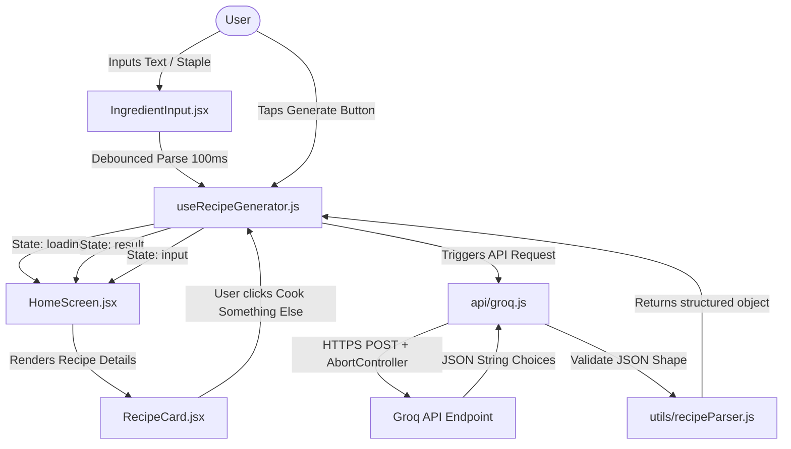

# Smart Ingredient Recipe Generator 🍳

A premium single-screen React Native (Expo) mobile utility app that generates detailed, professional recipes from ingredients you already have in your kitchen, powered by the Groq API (using the state-of-the-art `llama-3.3-70b-versatile` model).

Built with performance, premium UX/UI, and accessibility at its core.

---

## 🌟 Key Features

*   **Smart Ingredient Parsing:** Enter ingredients using commas (or spaces). The app automatically parses, de-duplicates, and displays them as animated pill tags.
*   **Pantry Staples Quick Add:** Frequently used kitchen staples (eggs, onion, pasta, cheese, etc.) can be toggled with a single tap to speed up input.
*   **Serving Size Selector:** Scale recipes dynamically. Select serving sizes from 1 to 8, and the AI adjusts quantities and instructions accordingly.
*   **Predefined Instant Recipes:** Access 3 high-quality predefined recipes immediately without waiting for API generation.
*   **Warm Kitchen UI Design:** Tailored design system built on parchment colors, spice-orange accents, serif headings (`Playfair Display`), and clean body text (`Inter`).
*   **Polished Loading Experience:** Features a custom wobbly pan animation with rising steam and shimmering skeleton placeholders that transition every 2 seconds.
*   **Detailed Structured Recipes:** Generates a structured JSON recipe with cook times, servings, difficulty level, bolded ingredient quantities, 8-12 detailed steps explaining the "why", and a specialized chef's tip card.
*   **Robust Edge-Case Handling:** Client-side 15-second timeout via `AbortController`, network connection detection, rate limit (429) warnings, character caps, and direct "Retry" controls inside notification banners.
*   **Haptic Feedback:** Interactive touches enhanced by light/heavy haptics using `expo-haptics`.
*   **Accessibility First:** Fully optimized with semantic labels, accessible live regions, tap targets, and support for system font scaling.

---

## 🛠️ Tech Stack

*   **Framework:** React Native + Expo (SDK 54)
*   **Styling:** StyleSheet (Vanilla CSS approach)
*   **AI Backend:** Groq API (`llama-3.3-70b-versatile`)
*   **Typography:** Google Fonts (`Playfair Display` + `Inter`) via `@expo-google-fonts`
*   **Haptics:** `expo-haptics`
*   **Safe Area:** `react-native-safe-area-context`

---

## 🚀 Setup & Installation

### Prerequisites

Make sure you have the following installed on your machine:
*   [Node.js](https://nodejs.org/) (Version 18 or higher recommended)
*   [Git](https://git-scm.com/)
*   A free Groq API key from the [Groq Console](https://console.groq.com/)
*   A physical device running iOS or Android with the [Expo Go](https://expo.dev/go) app installed, or an emulator (Xcode Simulator / Android Studio Emulator).

### Step-by-Step Installation

1.  **Clone the Repository:**
    ```bash
    git clone https://github.com/AdityaTel89/RecipeApp.git
    cd RecipeApp
    ```

2.  **Install Dependencies:**
    ```bash
    npm install
    ```

3.  **Configure Environment Variables:**
    Create a `.env` file in the root directory:
    ```bash
    # For Groq API Key
    EXPO_PUBLIC_GROQ_KEY=your_groq_api_key_here

    # Optional: For Gemini API Key (if using legacy backend)
    EXPO_PUBLIC_GEMINI_KEY=your_gemini_api_key_here
    ```

    > [!IMPORTANT]
    > The codebase references `EXPO_PUBLIC_GROQ_KEY` in the environment. Ensure this key is set correctly in your `.env` file.

4.  **Start the Expo Development Server:**
    ```bash
    # Standard start
    npm run start # or npx expo start

    # Start with specific emulator target
    npm run ios     # or npx expo start --ios
    npm run android # or npx expo start --android
    ```

5.  **Run on Your Device:**
    *   **iOS/Android Device (Expo Go):** Scan the QR code displayed in your terminal using your phone camera (iOS) or the Expo Go app (Android).
    *   **Emulator:** Press `i` in the terminal to launch the iOS Simulator or `a` to launch the Android Emulator.

---

## 📂 Project Structure

```
RecipeApp/
├── .env                       # API key configurations (ignored by git)
├── App.js                     # Root entry component, loads fonts and safe area providers
├── app.json                   # Expo configuration file
├── package.json               # Dependencies and build scripts
├── smart-ingredient-recipe-prd.md  # Detailed Product Requirements Document (PRD)
├── LICENSE                    # MIT License details
└── src/
    ├── api/
    │   ├── groq.js            # Groq API integration, system prompts, error handlers
    │   └── gemini.js          # Legacy Gemini API client (inactive)
    ├── components/
    │   ├── Header.jsx         # Branding header with custom SVG kitchen pan
    │   ├── IngredientInput.jsx# Text field, live parsing, counter, quick add staples
    │   ├── IngredientTag.jsx  # Individual pill tag with spring entrance and close actions
    │   ├── GenerateButton.jsx # Primary CTA button with haptics and warning badge
    │   ├── LoadingSkeleton.jsx# Shimmer bars, wobbly pan animation, rotating phrases
    │   ├── RecipeCard.jsx     # Scrollable recipe display card with meta row & refresh buttons
    │   ├── RecipeStep.jsx     # Individual numbered recipe step with custom style
    │   ├── ErrorToast.jsx     # Floating dismissible top toast with Retry logic
    │   └── TipCard.jsx        # Special chef's tip highlighted card
    ├── config/
    │   └── constants.js       # Color tokens, typography, constants, suggested recipes
    ├── hooks/
    │   └── useRecipeGenerator.js # Core hooks state machine (input -> loading -> result)
    ├── screens/
    │   └── HomeScreen.jsx     # State Router & Layout container
    └── utils/
        ├── recipeParser.js    # Sanitizes and parses LLM JSON outputs with fallback
        └── validators.js      # Raw validator helpers (inactive)
```

---

## ⚙️ Architecture & Data Flow



---

## 🔒 Security Best Practices for Production

1.  **Backend Proxy Gateway:**
    Currently, the application communicates directly with the Groq API from the mobile client. This embeds the API key (`EXPO_PUBLIC_GROQ_KEY`) in the client app bundle. For production deployment, **always proxy API requests through a secure server backend**. The mobile client should hit your backend server, which will authenticate the user, attach the API key, and call Groq.
2.  **Backend Rate Limiting:**
    In addition to client-side request cooling, protect your API budgets by configuring rate limits on your server gateway to prevent denial-of-service (DoS) or quota exhaustion.
3.  **Input Sanitization:**
    Ensure inputs are checked on your server side for malicious prompts to avoid prompt injections, ensuring the AI strictly returns safe, recipe-based outputs.

---

## 📄 License

Distributed under the MIT License. See [LICENSE](file:///c:/Projects/RecipeApp/RecipeApp/LICENSE) for more details.
